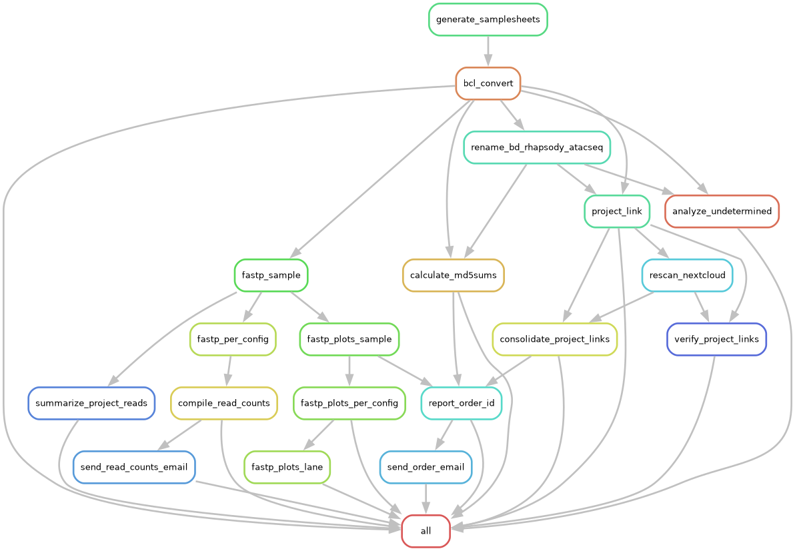

# Snakemake BCL Conversion Pipeline (HPC3)

Automated workflow for Illumina (MiSeq i100 / NovaSeqX) sequencing data processing, quality control, and report generation. Runs on HPC3 via Singularity + slurm — no DRAGEN instrument required.

## Workflow Diagram



## Overview

This Snakemake pipeline handles the complete sequencing data processing workflow:
1. **BCL Conversion** - bcl-convert (via Singularity) to FASTQ with per-lane sample sheets
2. **Post-hoc Demultiplexing** - fqtk recovers samples that bcl-convert cannot demultiplex
   (index collisions, `*fqtk*` projects) from the lane's Undetermined reads; flexbar handles
   inline-barcode libraries
3. **File Renaming** - Systematic renaming based on lane, group, position, and barcode
4. **Quality Analysis** - FastP quality metrics for all samples
5. **Visualization** - Quality plots (mean Phred scores, base composition)
6. **Report Generation** - Comprehensive HTML reports grouped by Order ID with embedded plots and download instructions
7. **Read Count Compilation** - Lane-level read counts formatted as CSV, aggregated per library
8. **Email Notifications** - Automated email delivery of reports and read counts (optional, off by default)

## Installation

```bash
git clone https://github.com/uci-grthub/bcl_conversion_hpc3.git {RUN_NAME}
cd {RUN_NAME}
```

### HPC3 access prerequisites

This workflow reads and writes lab-group paths. Before anything else, confirm you
have all three — none of them are things the workflow can grant itself:

| Need | Check | Why |
|------|-------|-----|
| Group `ucightf` | `id \| grep ucightf` | `/dfs9/ucightf-lab` is `drwxrws---`; without it you cannot even traverse into the container or the lab share |
| Group `ucightf_lab_share` | `id \| grep ucightf_lab_share` | `/dfs3b/ucightf_lab/NSRaw` (the BCL staging dir) is likewise group-only |
| A slurm account | `sacctmgr -nP show assoc user=$USER format=Account` | Every job is submitted with `--account`; see [HPC3 Execution Profile](#hpc3-execution-profile) |

Ask RCIC / the lab PI to be added to the groups. A missing group shows up as a
"No such file or directory" on a path that plainly exists — the directory is
unreadable, not absent.

### Container image

The **entire** workflow runs inside one Singularity image — bcl-convert, every other
tool, and the Snakemake driver itself. The image is kept on the lab share and readable
by group `ucightf`; the path is the `container_sif` key in `snakemake_config.yaml`:

```yaml
container_sif: "/dfs9/ucightf-lab/containers/bcl_convert.sif"
```

Nothing to configure — being in group `ucightf` is the only requirement. If that path
reports "No such file or directory", you are not in the group; check with
`id | grep ucightf`. Override for a single run with `export BCL_CONVERT_SIF=...`.

**How SLURM works from inside a container.** `run_hpc3_container.sh` starts Snakemake
in the image with the host's SLURM client bind-mounted in (`sbatch`, `srun`, `squeue`,
`scancel`, `sacct`, plus `/usr/lib64/slurm`, `/usr/lib64/libmunge.so.2`, `/etc/slurm`
and the `/var/run/munge` socket — see `scripts/container_binds.sh`). The image ships no
slurm packages of its own, so it follows HPC3 through upgrades instead of drifting out
of lockstep with `slurmctld`. Every job Snakemake spawns re-enters the same image
through `.container/bin/python`, a shim the launcher generates per run. Two flags make
that work and are passed by the launcher, not the profile:

- `--shared-fs-usage` **without** `software-deployment` — otherwise Snakemake puts its
  own in-container interpreter path into the spawned command, and the compute node
  cannot find it.
- `--precommand` — puts the shim directory first on the compute node's `PATH`.

The shim then does three things that are each load-bearing, and each of which failed a
real test run before being added:

1. `mkdir -p /tmp/bcl-convert-logs` — `/tmp` is node-local, so the launcher creating it
   on the login node says nothing about the compute node, and singularity refuses to
   start when a bind source is missing.
2. `unset SINGULARITY_BIND` — singularity exports that variable into the container to
   describe its own binds, and SLURM's `--export=ALL` carries it to the compute node,
   where it would duplicate every mount and drag along login-node-only paths.
3. Appends `--executor local` — the slurm executor hardcodes `--executor slurm-jobstep`
   into every spawned command, and that executor wraps the work in `srun`. `srun`
   launches its task on the *host*, outside the container, while asking for the
   interpreter by its absolute in-container path — because the jobstep executor extends
   `RealExecutor` rather than `RemoteExecutor` and so never sees the `--shared-fs-usage`
   conditional; its `get_python_executable()` returns `sys.executable` unconditionally.
   No flag disables that `srun`, so the shim overrides the executor instead (argparse
   takes the last occurrence). Jobs still run inside the allocation's cgroup, so SLURM
   resource limits still apply; only `srun`'s cpu-binding is lost.

This is also why the image must be **Rocky 9**: HPC3's `sbatch` is linked against
glibc 2.34, which the previous Rocky 8 base (2.28) cannot load.

The image is built from the private `whtns/containers` repo
(`bcl_convert/Dockerfile`: Rocky 9 + the `bcl-convert-4.4.6` RPM + this repo's own
`pixi.toml`/`pixi.lock` installed to `/app/.pixi/envs/default`) and pushed to a
**private** GHCR package. Neither the repo nor the package is publicly pullable, so the
group-readable `.sif` above is the supported way to get it. Rebuilding needs access to
that repo plus a manual download of the bcl-convert RPM from
[Illumina](https://support.illumina.com/sequencing/sequencing_software/bcl-convert/downloads.html).

> The image installs **this repo's** `pixi.lock`, copied into the build context. Change
> a tool version in `pixi.toml`, run `pixi lock`, copy both files to the container repo,
> rebuild. The image can then never disagree with what a host pixi env would resolve.

```bash
# with access to ghcr.io/whtns/bcl_convert
module load singularity
singularity pull bcl_convert.sif docker://ghcr.io/whtns/bcl_convert:latest
```

Verify whichever copy you use — the second command is the one that matters, since it
exercises the glibc and munge plumbing that in-container submission depends on:

```bash
module load singularity
SIF=/dfs9/ucightf-lab/containers/bcl_convert.sif

singularity exec --writable-tmpfs "$SIF" bcl-convert --version   # Version 4.4.6

source scripts/container_binds.sh
singularity exec $(container_binds_flat) "$SIF" squeue -u "$USER"
```

A `GLIBC_2.34 not found` from the second command means the image is still on a Rocky 8
base. A munge error means the `/var/run/munge` bind or `libmunge.so.2` is missing.

`--writable-tmpfs` is required for bcl-convert: it writes to `/var/log/bcl-convert`
inside the container and aborts if that path is read-only. The launcher additionally
binds `/tmp/bcl-convert-logs` over it, because the tmpfs overlay is small and the logs
are not.

The data binds are `/dfs3b` (the BCL run directories) and `/dfs9` (the lab share and
run working directories). Cloning a run somewhere else — `/pub/$USER`, say — means
adding that filesystem to `CONTAINER_DATA_BINDS` in `scripts/container_binds.sh`, or
the container cannot see its own inputs and outputs.

## Environment

**The container is the runtime.** Running the workflow needs the `.sif`, this repo, and
`module load singularity` — no pixi, no python, no conda on the host:

```bash
module load singularity
bash run_hpc3_container.sh --dryrun   # preview what would run
bash run_hpc3_container.sh            # full workflow
```

`pixi.toml` (locked in `pixi.lock`) is still the single source of truth for *what* is
installed — the image builds its environment from those two files — and a host pixi env
remains useful for development and as a fallback path. Install pixi once, then:

```bash
curl -fsSL https://pixi.sh/install.sh | bash   # one-time install
pixi install                                    # solve/create env from pixi.lock
```

```bash
pixi run init                 # one-time per-run setup (project config + samplesheet)
pixi run validate             # check the metadata workbook
pixi run dry-run              # preview what would run (run_hpc3.sh --dryrun)
pixi run all                  # full workflow on the host env (run_hpc3.sh)
pixi run convert output/lane1 # BCL conversion for a single lane
```

> `run_hpc3.sh` is the host/pixi path and `run_hpc3_container.sh` the container path.
> They run the same DAG with the same profile; the container one additionally needs no
> host environment, and is what cron uses.

> `pixi run` auto-loads secrets from **`~/.env`**, then from a run-local `./.env` if
> one exists (only needed when `enable_nextcloud`/`send_emails` are turned on), and
> forces `SNAKEMAKE_PROFILE=profiles/hpc3` (see `[activation]` in `pixi.toml` and
> `scripts/load_dotenv.sh`). `run_hpc3.sh` also passes `--profile profiles/hpc3`
> explicitly, so no manual `--profile` flag or `source .env` is needed.

Credentials belong in `~/.env` — one personal copy, reused by every run directory you
clone, outside every repo so it cannot be committed by accident:

```bash
cp .env.example ~/.env && chmod 600 ~/.env
```

A `./.env` inside a run directory overrides it for that run only, and is gitignored.

`pixi.toml` describes Python (pandas, openpyxl, numpy, matplotlib, pillow, pyyaml,
reportlab), Snakemake (+ the slurm executor plugin), and the bioconda CLIs (`fastqc`,
`flexbar`, `seqtk`, `fqtk`, `seqkit`, `pigz`) — the same set whether it is solved on the
host or baked into the image. Two dependencies remain **system-level**:

- **Singularity**, via `module load singularity`. The only host requirement left on the
  container path. Resolved by `scripts/find_singularity.sh`, which finds a real binary
  path rather than relying on the Lmod shell function. The image itself is a separate
  artifact; see [Container image](#container-image).
- An **optional custom `flexbar` build**. `flexbar_bin` defaults to `""`, which uses the
  bioconda flexbar. Set it to an absolute path only for a speedup build (e.g.
  `/dfs9/ucightf-lab/kstachel/TOOLS/build_parasail/src/flexbar`); a non-executable path
  there is a hard error rather than a fallback. On the container path the path must be
  inside a bind-mounted filesystem.

> The legacy `bcl_convert` mamba/conda environment is being retired in favor of pixi.

## Key Files

- **`Snakefile`** - Main workflow definition; imports rules from `src/workflow_defs.smk`
- **`snakemake_config.yaml`** - Base configuration (paths, threads, email settings)
- **`snakemake_config_project.yaml`** - Project-specific configuration (overrides base settings)
- **`run_hpc3_container.sh`** - Container entry point: runs Snakemake itself inside the
  image and generates the compute-node shim. The supported way to run the workflow
- **`scripts/container_binds.sh`** - The bind list shared by the launcher and the shim
  (data filesystems + the host SLURM client)
- **`profiles/hpc3/config.yaml`** - HPC3 executor profile (slurm, resource defaults)
- **`metadata/*.xlsx`** - Excel metadata with Summary sheet and per-project sheets
- **`src/RunInfo_nn.xml`** - Normalized run configuration (auto-generated)
- **`src/barcode_collisions.py`** - Detects unresolvable index collisions and routes those
  projects to the fqtk path
- **`scripts/resolve_fqtk_barcodes.py`** - Extends short fqtk barcodes to the run's full index
  length from observed Undetermined reads, adds decoy entries, and derives fqtk's matching thresholds
- **`scripts/validate_barcode_hamming_distance.py`** - Sample-sheet barcode distance check
  (prefix-aware; can auto-fix `BarcodeMismatchesIndex`)

## Platforms & Auto-Detection

This pipeline supports two Illumina platforms/configurations. The platform is
**auto-detected from the metadata workbook** at workflow start (no config flag needed):

| Aspect | MiSeq i100 | NovaSeqX |
|--------|-----------|----------|
| Detection | Has a `Barcode Entries` sheet, no `Summary` sheet | Has a `Summary` sheet |
| Lanes | Single lane (`lane1`) | Up to 8 lanes (`lane1`…`lane8`) |
| Groups | Single group per lane | Multiple groups per lane |
| Order IDs | Inferred from `Lab ID` column of the first sheet | Read from the `Summary` sheet |
| Example `data_dir` | `/dfs3b/ucightf_lab/NSRaw/<run>` | `/dfs3b/ucightf_lab/NSRaw/<run>` |

The workflow prints `Detected MiSeq metadata format` (or proceeds with the NovaSeqX
Summary-sheet path) so you can confirm which mode is active. The run identifier below
(`{RUN}`, e.g. `iR011` / `xR077`) comes from your metadata filename.

## Configuration

Edit `snakemake_config_project.yaml` (project overrides layered over `snakemake_config.yaml`).

Most fields are prefilled by `pixi run init`; set `email_*` to **your** address.

**MiSeq i100 example**:

```yaml
library_name: "iR011"                    # Run identifier
metadata: "metadata/06262026_BXA66618-2426_iR011.xlsx"
data_dir: "/dfs3b/ucightf_lab/NSRaw/20260626_SH00564_0020_ASC2231455-SC3"
lanes: [1,2,3,4,5,6,7,8]                 # Superset; only lane1 is used for MiSeq
```

**NovaSeqX example**:

```yaml
library_name: "xR077"                    # Run identifier
metadata: "metadata/251219_23G5F2LT3_10B_PE151_xR077.xlsx"
data_dir: "/dfs3b/ucightf_lab/NSRaw/20260115_LH00626_0088_A233NM2LT4"
lanes: [1,2,3,4,5,6,7,8]                 # Lanes to process (auto-detected from BaseCalls)
```

`email_sender`/`email_recipient` only need setting if `send_emails: true`.

`bcl_convert_order` defaults to `[]` (empty) — lanes are already serialized by the
`bcl_convert` DAG chain, so an explicit order is only needed to force a non-default sequence.

## HPC3 Execution Profile

`profiles/hpc3/config.yaml` drives slurm submission:

| Setting | Value | Why |
|---------|-------|-----|
| `executor` | `slurm` | Jobs submitted to HPC3 |
| `slurm_partition` | `standard` | `free` gets preempted mid-conversion |
| `slurm_account` | `sbsandme_lab` | Pinned; auto-guessing was unreliable. **Not yours?** `export SLURM_ACCOUNT=<your_account>` — `run_hpc3.sh` picks it up, no file edit needed |
| `cores` | `32` | Snakemake downscales a rule's `threads:` to this, so it must be >= the largest one (32) |
| `jobs` | `32` | Concurrent slurm jobs |
| `keep-going` | `True` | One failed project doesn't stall the rest of the run |
| `latency-wait` | `120` | dfs9 (JBOD/NFS) is slow to expose outputs after a job exits |
| `rerun-triggers` | `mtime` | An unrelated Snakefile edit won't re-run bcl-convert |
| `default-resources` | 8000 MB / 60 min | Per-rule overrides below |

There is **no** `serial_operation` cap here — that exists in `profiles/default` to serialize
DRAGEN-FPGA jobs. HPC3 runs software bcl-convert, and lanes are already serial via the DAG.

`run_hpc3.sh` passes `--workflow-profile none`. Without it Snakemake auto-merges
`profiles/default` (the DRAGEN-server profile), whose settings win over `--profile` and
silently reimpose `serial_operation=1`, blocking all job parallelism.

**Per-rule resource overrides** (in the `Snakefile`, measured from `benchmarks/`):

| Rule | Threads | Memory | Runtime |
|------|---------|--------|---------|
| `bcl_convert` / `bcl_convert_rc` | 24 | 48 GB | 480 min |
| `flexbar_per_config` | 32 | 64 GB | 480 min |
| `flexbar_pair_r2` | 32 | 32 GB | 480 min |
| `fqtk_per_config` | 8 | 16 GB | 480 min |
| `calculate_md5sums` | 8 | profile default | profile default |

Peak bcl-convert RSS across all 8 lanes measured ~23 GB, so 48 GB keeps 2× headroom without
queueing for a 144 GB block.

## Metadata Format

### NovaSeqX (Summary-sheet format)
- **Summary sheet** (header at row 3):
  - `Lane`, `Gr` (Group), `Project Name`, `Masking`, `Fastq Link`
- **Per-project sheets** with sample details:
  - `Lane`, `Group`, `Sample Name`, `i7 Barcode Sequence`, `i5 Barcode Sequence`

**Masking format**: `R1:151, I1:8, I2:8, R2:151` → generates OverrideCycles

A blank `Masking` cell on a populated Summary row is a **fatal** error — the workflow stops
before any conversion with the offending lane/group listed. Fill the cell, or set
`ALLOW_MISSING_MASKING=1` in the environment for the rare intentional-blank case.

### MiSeq i100 (simple format)
- A **`Barcode Entries`** sheet with per-sample barcodes (no `Summary` sheet)
- The first sheet's **`Lab ID`** column supplies both project labels (e.g. `PaegB`)
  and Order IDs (e.g. `0626I-08`); order IDs match the pattern `\d+I-\d+`
- All samples are assigned to a single lane (`lane1`) and single group

## Workflow Steps

Configs are identified per lane as `lane{N}` (e.g. `lane1`). MiSeq i100 runs use only
`lane1`; NovaSeqX runs may use `lane1` through `lane8`. Generated sample sheets, renaming
maps, and per-lane artifacts live under `results/lane{N}/`.

### 1. Sample Sheet Generation (automatic)
- Parses metadata Excel file
- Generates per-lane sample sheets in `results/lane{N}/SampleSheet_lane{N}.csv`
- Creates renaming maps in `results/lane{N}/renaming_map_lane{N}.csv`
- Produces Flexbar barcode files for Flexbar-tagged projects

### 2. BCL Conversion
```bash
bash run_hpc3.sh output/lane1
```
- Runs bcl-convert (Singularity container) per lane configuration
- Applies OverrideCycles from metadata masking field
- Creates project subdirectories
- Renames FASTQ files using renaming map: `{Run}-L{Lane}-G{Group}-P{Position}-{Barcode}`
- Index reads (I1/I2) are deleted per project unless the project name contains one of
  `10x`, `BD`, `parse`, `SMK`, `CITE`, `Hashtag` (case variants included), or `no_demux` is set

### 3. Post-hoc Demultiplexing (fqtk)
```bash
pixi run snakemake --profile profiles/hpc3 results/lane2/fqtk_lane2.done
```
- Runs automatically for any lane with a `metadata/fqtk_barcodes_{config_id}.tsv`
- Demultiplexes the lane's Undetermined reads by I1 (see [fqtk Post-Hoc Demultiplexing](#fqtk-post-hoc-demultiplexing))
- Outputs to `output/{config_id}/fqtk/` plus `demux-metrics.txt`, then stages files into the
  project directory under canonical names

### 4. Quality Analysis (FastP)
```bash
pixi run snakemake --profile profiles/hpc3 --cores 4 results/fastp_lane1.done
```
- Runs FastP on all samples per config
- Outputs JSON stats to `results/fastp/lane{N}/{project}/{sample}.json`

### 5. Quality Plots
```bash
pixi run snakemake --profile profiles/hpc3 --cores 4 results/lane1/fastp_plots_lane1.done
```
- Generates mean Phred and base composition plots
- Outputs PNG files to `results/fastp_plots/lane{N}/{project}/{sample}-*.png`

### 6. Project/Order Reports
```bash
pixi run snakemake --profile profiles/hpc3 --cores 1 Reports/order_0626I-08/index.html
```
- Creates comprehensive HTML reports grouped by `Order ID`
- Includes summary of all projects associated with the order
- Embeds quality plots as base64 images
- Includes download instructions (browser, wget, HPC) and sorted md5 checksums; the WebDAV
  instructions require **Cyberduck 9.5.2+** (older versions fail with a misleading
  "DNS lookup failed" error) and keep host and path in separate fields
- Read counts resolve against reverse-complemented index orientations, so a lane demuxed from
  an RC'd sample sheet still reports counts
- Outputs:
  - `Reports/order_{id}/index.html`
  - `Reports/order_{id}/md5sums.txt`
  - `Reports/order_{id}/Download_Instructions.pdf`
  - `Reports/{project}/lane{lane}/index.html`

### 7. Read Count Compilation
```bash
pixi run snakemake --profile profiles/hpc3 --cores 1 results/iR011-count.csv
```
- Aggregates read counts across all lanes
- Formats as CSV with lane/group/sample/counts columns
- Sorted by read count (descending) per lane
- fqtk-demultiplexed samples never appear in `Demultiplex_Stats.csv`; their counts are read
  from `output/{config_id}/fqtk/demux-metrics.txt` and placed in their real lane/group column

### 8. Email Delivery
```bash
pixi run snakemake --profile profiles/hpc3 --cores 1 Reports/iR011_read_counts_email.done
```
- Sends read count CSV as attachment
- Uses SMTP over SSL (`smtp.gmail.com:465`, see `src/send_email.py`); authenticates as
  `email_sender` with `GMAIL_APP_PASSWORD` from `.env`

## Common Commands

**Dry run (see what would execute):**
```bash
pixi run snakemake --profile profiles/hpc3 -n
```

**Run entire workflow:**
```bash
pixi run snakemake --profile profiles/hpc3 --cores 8
```

**Run specific project report:**
```bash
pixi run snakemake --profile profiles/hpc3 --cores 4 Reports/MyProject/index.html
```

**Analyze undetermined indices:**
```bash
pixi run snakemake --profile profiles/hpc3 --cores 1 results/undetermined_indices/lane1.csv
```

**Force re-run a specific rule:**
```bash
pixi run snakemake --profile profiles/hpc3 --cores 4 -R compile_read_counts
```

**View rule graph:**
```bash
pixi run snakemake --profile profiles/hpc3 --rulegraph | dot -Tpdf > rulegraph.pdf
```

**View complete dependency graph:**
```bash
pixi run snakemake --profile profiles/hpc3 --dag | dot -Tpdf > dag.pdf
```

## Output Structure

```
output/
  lane{N}/
    {project}/
      {Run}-L{Lane}-G{Group}-P{Position}-{Barcode}-R1.fastq.gz
      {Run}-L{Lane}-G{Group}-P{Position}-{Barcode}-R2.fastq.gz
    fqtk/                       # only on lanes routed to post-hoc demux
      {sample}.R1.fq.gz
      {sample}.R2.fq.gz
      demux-metrics.txt

metadata/
  fqtk_barcodes_lane{N}.tsv               # routed samples (generated)
  fqtk_barcodes_lane{N}_resolved.tsv      # full-length barcodes + decoys (generated)

results/
  lane{N}/
    SampleSheet_lane{N}.csv
    renaming_map_lane{N}.csv
    fqtk_lane{N}.done
  fastp/
    lane{N}/{project}/{sample}.json
  fastp_plots/
    lane{N}/{project}/{sample}-mean_phred.png
    lane{N}/{project}/{sample}-base_comp.png
  undetermined_indices/
    lane{N}.csv
  {library}-count.csv

Reports/
  order_{id}/
    index.html
    md5sums.txt
    Download_Instructions.pdf
    email_sent.done
  {project}/
    lane{lane}/
      index.html
      md5sums.txt
  {library}_read_counts_email.done
```

## Undetermined Reads

Two config options control how Undetermined (unassigned) reads are handled per lane:

- **`keep_undetermined_configs`** - lanes whose Undetermined FASTQs are retained
  instead of deleted after conversion. Example: `keep_undetermined_configs: ['lane1']`
- **`report_undetermined_configs`** - lanes where Undetermined reads are treated as a
  normal sample: renamed into the lane's first project directory and flowed through the
  full pipeline (fastp QC, read counts, md5sums, nextcloud links, and the per-order HTML
  report). Lanes listed here are automatically added to `keep_undetermined_configs`.
  Example: `report_undetermined_configs: ['lane1']`

Undetermined reads are also kept automatically when a
`flexbar_barcodes_{config_id}.txt` or `fqtk_barcodes_{config_id}.tsv` file exists for the lane.

## fqtk Post-Hoc Demultiplexing

Some samples cannot be demultiplexed by bcl-convert at all. They are pulled out of the lane's
sample sheet and recovered afterwards from the Undetermined reads with `fqtk`. **No config
flag or metadata annotation is needed** — routing is decided from the generated sample sheet.

**A project is routed to fqtk when:**
1. Its name contains `fqtk` (case-insensitive), or
2. One of its indexes is a **prefix collision** with a longer index on the same lane
   (e.g. `GTAGAG` vs `GTAGAGGA`). bcl-convert compares mixed-length indexes at their common
   value and aborts the whole lane with `hamming distance errors occurred in the Sample Sheet`;
   no `BarcodeMismatchesIndex` value fixes it. The *shorter*-index project is dropped from the
   sheet so the longer, more specific index wins, and its reads are recovered from Undetermined.

**How it runs** (`rule fqtk_per_config`, 8 threads / 16 GB / 480 min):
- Sample sheet generation writes `metadata/fqtk_barcodes_{config_id}.tsv` (`sample_id`, `barcode`)
  and removes those rows from the bcl-convert sheet
- The lane's I1 read length is probed to build the fqtk read structure (`8B{n}S`)
- `scripts/resolve_fqtk_barcodes.py` extends short barcodes to the full sequenced index length
  using the dominant matching form observed in the Undetermined I1 reads, and writes every index
  from the bcl-convert sheet as a **decoy** entry so reads belonging to already-demultiplexed
  samples cannot leak into a recovered one. It fails loudly if a resolved barcode is identical
  to a sheet index. Matching thresholds (`--max-mismatches`, `--min-mismatch-delta`) are derived
  from the finished table and written to `{resolved}.params`
- `fqtk demux` runs; `unmatched.*` and `decoy__*` FASTQs are deleted afterwards
- `rule fqtk_stage_project` stages the result into the project directory under canonical
  `{Run}-L{Lane}-G{Group}-P{Position}-{Barcode}` names (DRAGEN-style names for BD/10x projects)

**Files produced:**
- `metadata/fqtk_barcodes_{config_id}.tsv` — routed samples and their sheet indexes
- `metadata/fqtk_barcodes_{config_id}_resolved.tsv` (+ `.params`) — full-length barcodes, decoys, thresholds
- `output/{config_id}/fqtk/` — `{sample}.R1.fq.gz`, `{sample}.R2.fq.gz`, `demux-metrics.txt`, `md5sum.txt`, `size.txt`
- `results/{config_id}/fqtk_{config_id}.done`

fqtk lanes require the Pass-1 conversion to have written index FASTQs
(`CreateFastqForIndexReads=1`); the rule fails with an explicit message if the Undetermined
R1/I1/R2 files are missing.

## Email Configuration

Off by default on HPC3 (`send_emails: false`). When enabled, the workflow uses
`src/send_email.py` via Gmail SMTP (`smtp.gmail.com`), authenticated with
`GMAIL_APP_PASSWORD` from `.env` — see `.env.example`.

## Troubleshooting

**Missing lanes in workflow:**
- Check `detected_lanes` output at workflow start
- Verify `data_dir` in config points to the correct run directory (with `Data/Intensities/BaseCalls`)

**BCL conversion fails:**
- Verify `data_dir` and `run_info_path` are correct
- Check Singularity is available: `module load singularity`
- Review OverrideCycles match actual run cycles

**`Missing Masking value in Summary tab for: lane N group G`:**
- Fill the `Masking` cell for that Summary row; the workflow refuses to start otherwise
- Bypass only if the blank is intentional: `ALLOW_MISSING_MASKING=1 bash run_hpc3.sh`

**`hamming distance errors occurred in the Sample Sheet` (bcl-convert aborts a lane):**
- Mixed index lengths colliding on their common prefix. The pipeline now detects this at
  sample-sheet generation and routes the short-index project to fqtk automatically — look for
  `Index collision on lane{N}: ...` in the workflow output
- If the validator reports `UNRESOLVABLE i7 prefix collision`, `BarcodeMismatchesIndex=0` and
  reverse-complementing will not help; pad/replace the short index or split the lane

**fqtk lane produced no reads for a sample:**
- Check `logs/{config_id}/fqtk_{config_id}.log` for the resolved barcodes and thresholds
- A sample that ties against a decoy sends every read to `unmatched`; the thresholds in
  `metadata/fqtk_barcodes_{config_id}_resolved.tsv.params` show how close the call was

**Jobs OOM-killed or hit the slurm time limit:**
- Compare against `benchmarks/{rule}_{config_id}.bench` and raise the rule's `resources:`
  block in the `Snakefile`; the profile default is only 8000 MB / 60 min

**No samples in report:**
- Check metadata Excel file has correct sheet names and headers
- Verify projects are listed in Summary sheet
- Look for "PROJECTS found in SampleSheet" in workflow output

**md5 mismatches:**
- Re-run specific project: `pixi run snakemake --profile profiles/hpc3 -R report_project --cores 1 Reports/{project}/md5sums.txt`
- Verify FASTQ files weren't modified after generation

## Advanced Features

**Flexbar / inline demultiplexing** (for Flexbar-tagged projects):
- Requires barcode FASTA files (auto-generated from metadata)
- `flexbar_barcode_leader_n` sets leading bases (e.g. a UMI) before the inline barcode
  in R1 (0 = barcode at position 1; 5 for PAREseq-style U5I6 libraries)
- `flexbar_retry_min_reads` triggers a reverse-complement retry pass if no sample
  exceeds the threshold after the forward pass
- Processes undetermined reads

**Excluding orders:**
- Set `exclude_order_ids: ["0626I-08"]` to skip processing, reports, and emails for
  specific Order IDs

**Scratch space for conversion:**
- Set `scratch_dir` to fast local NVMe; bcl-convert writes FASTQs there first, then moves
  them to `output/` (avoids writing directly to slow JBOD/network storage)

**Tile-specific processing:**
- Set `tiles: "1_1101"` in config for subset processing
- Useful for test runs or debugging

## Notes

- Run commands via `pixi run` (environment provisioned from `pixi.toml` / `pixi.lock`)
- The workflow auto-detects lanes from the BaseCalls directory
- Sample sheets are generated once at workflow start from metadata
- md5 checksums are sorted by position number (P001, P002, ...)
- Reports include embedded images for email compatibility
- 2-week data retention policy is noted in all reports
